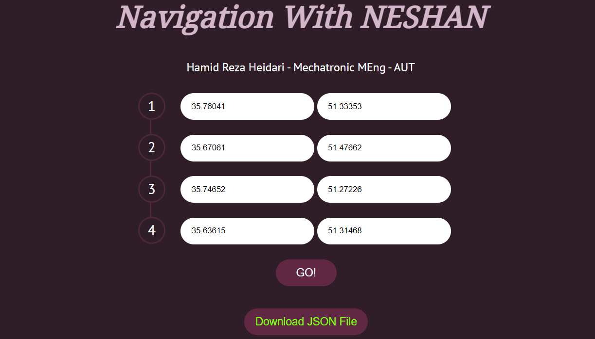
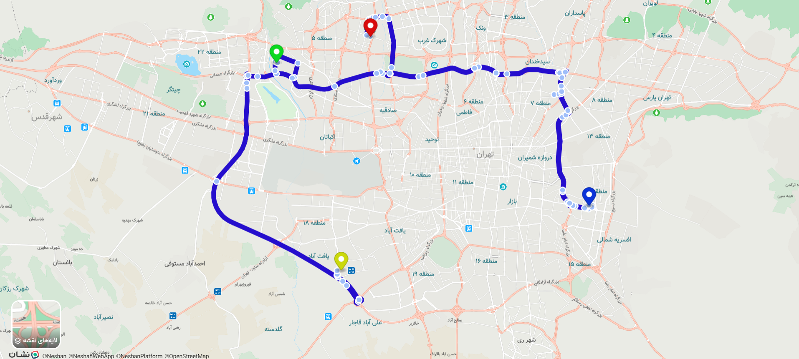

## 🚗 Navigation with NESHAN API

In this project, I developed a simple yet powerful routing API that connects directly to the Neshan Navigation Server — all without using any JavaScript.
By providing between two to four location points, the API communicates with Neshan’s routing service, requests the optimal navigation path, and returns the route data in a clean and usable format.
Additionally, users can easily download the generated route as a JSON file, making it simple to integrate into other systems, visualize, or analyze.

## 🔍 Features

-Connects to Neshan routing API seamlessly        
-Accepts 2–4 location points as input            
-Returns best route and navigation details             
-Allows users to download route results as JSON           
-No need for JavaScript or client-side dependencies       

## 🚀 How It Works

1️⃣Send location coordinates to the API (2–4 points).        
2️⃣The system requests an optimized route from the Neshan server.       
3️⃣The best navigation path and route details are returned.         
star if you like it ✨
   

  
   
  
   

